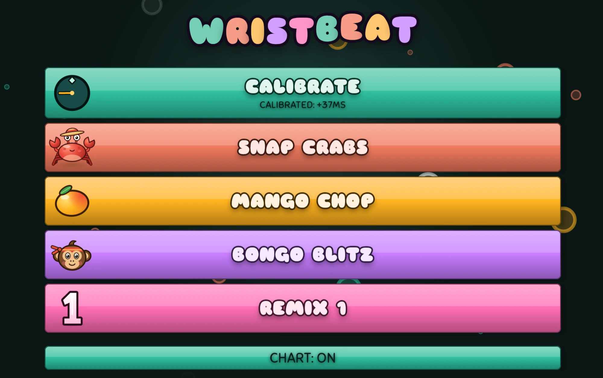
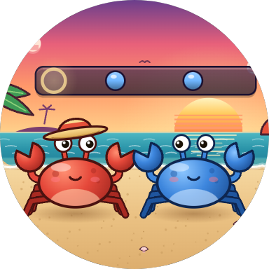
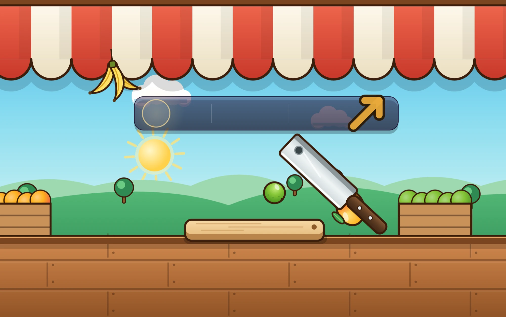
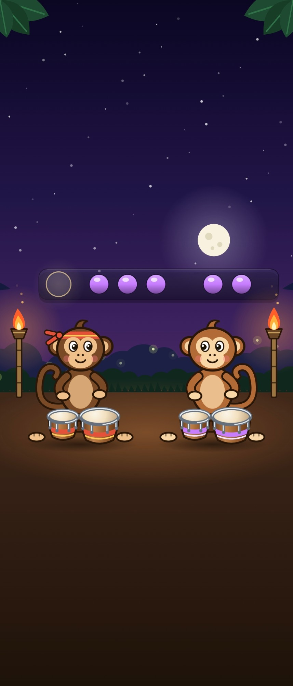

<div align="center">

# Wristbeat

**Short, snappy one-button rhythm minigames, with original music and art.**
Plays in the browser, on Android phones, and on Wear OS watches.

[**▶ Play it in your browser**](https://webrender.net/wristbeat/) ·
[Android APK](https://github.com/webrender/wristbeat/releases/latest/download/wristbeat-android.apk) ·
[Wear OS APK](https://github.com/webrender/wristbeat/releases/latest/download/wristbeat-wear.apk)



</div>

---

Wristbeat is a rhythm game in the spirit of *Rhythm Heaven*. Each stage is a tiny scene with its own
song, and the whole game uses just a **tap** and a **swipe**, so it plays just as well on a watch
face as on a phone or a desktop browser. Every sound is synthesized live, so there are no audio
files, and every tap is judged against the audio clock instead of the frame clock, so timing stays
accurate.

## Stages

<table>
<tr>
<td width="50%" valign="top">

### 🦀 Snap Crabs
A lead crab snaps out a rhythm and you snap it back, call-and-response style, over a breezy ukulele
beach band at 116 BPM. The verse keeps things easy, and the chorus doesn't.

</td>
<td width="50%" valign="top">



</td>
</tr>
<tr>
<td width="50%" valign="top">

### 🥭 Mango Chop
A whistle means fruit is coming. **Tap** to chop the mangoes and limes as they land, and **swipe**
to slice the pineapples that show up in the bridge. It's a 140 BPM soca tune with steel pan and
shaker, and the wrong move means the fruit bounces off.

</td>
<td width="50%" valign="top">



</td>
</tr>
<tr>
<td width="50%" valign="top">

### 🐒 Bongo Blitz
The hardest stage. A monkey plays a phrase on its high drum (**tap**) and low drum (**swipe**), and
you have to repeat it exactly, rhythm and drum both, one bar later. It runs at 172 BPM over a jungle
exotica tune on marimba and pan flute, with long syncopated runs.

</td>
<td width="50%" valign="top">



</td>
</tr>
</table>

### 1️⃣ Remix 1
A Rhythm Heaven–style remix. One 128 BPM disco-pop song runs straight through while the gameplay
swaps from Snap Crabs to Mango Chop to Bongo Blitz, eight bars each, with new patterns and an inked
wipe between scenes. The song changes key and instruments to follow each stage.

### ⏱️ Calibrate
A 20-beat click track that measures your audio/input latency. The offset is saved **per audio
output**, so Bluetooth headphones and the phone speaker each keep their own. It shifts both the
judging and the visuals, so the note highway waits for the sound instead of running ahead of it.

## Features

- **One input, two gestures.** Tap and swipe work by touch, mouse, or keyboard (Space/J/F/Enter to
  tap, D/K/arrow keys to swipe). A tap counts the moment your finger lands, not when you lift it.
- **Note highway.** An optional visual chart of upcoming beats. You can switch it off from the menu
  and play by ear.
- **Perfect streaks.** Hit more than 5 Perfects in a row and a gold starburst counts the streak,
  throbbing on every beat.
- **Results & records.** When a song ends, a results screen wipes in with a count-up score, a rank,
  confetti (or a drizzle), and a "New record!" badge when you beat your best.
- **Scales to any screen.** The stage stays a centered square at the largest size that fits, and the
  background art fills the margins, from a round watch face to an ultrawide monitor.

## Tech

Wristbeat is built with **Kotlin Multiplatform** and **Compose Multiplatform**, so one codebase
covers the web (Wasm), Android, and Wear OS.

| Module | What's in it |
| --- | --- |
| `core/` | Pure Kotlin with no UI: charts and songs (authored in beats), timing and judgment math, and each stage's state machine. Unit-tested. |
| `composeApp/` | The Compose UI for every stage, the menu, the HUD and results, plus platform audio. On web, sounds are synthesized with Web Audio. On Android, a low-latency `AudioTrack` is fed by software synth voices. |
| `androidApp/` | Thin phone app shell. |
| `wearApp/` | Standalone Wear OS app with a native watch menu and swipe-to-dismiss navigation. |

## Building

You need JDK 17. The Android builds also need an Android SDK (set `sdk.dir` in `local.properties`).

```bash
./gradlew :core:jvmTest
```

```bash
./gradlew :composeApp:wasmJsBrowserDevelopmentRun
```

The second command serves the web build at http://localhost:8080. It doesn't hot-reload, so restart
it after each code change.

```bash
./gradlew :androidApp:assembleDebug :wearApp:assembleDebug
```

Every push to `main` runs the tests, publishes signed phone and watch APKs as a
[GitHub Release](https://github.com/webrender/wristbeat/releases/latest), and deploys the web build
to [GitHub Pages](https://webrender.net/wristbeat/).

## Credits

The game UI is set in [Sniglet](https://fonts.google.com/specimen/Sniglet) under the SIL Open Font
License (see [`THIRD_PARTY_LICENSES/sniglet-OFL.txt`](THIRD_PARTY_LICENSES/sniglet-OFL.txt)). All
music and sound effects are synthesized in code.
